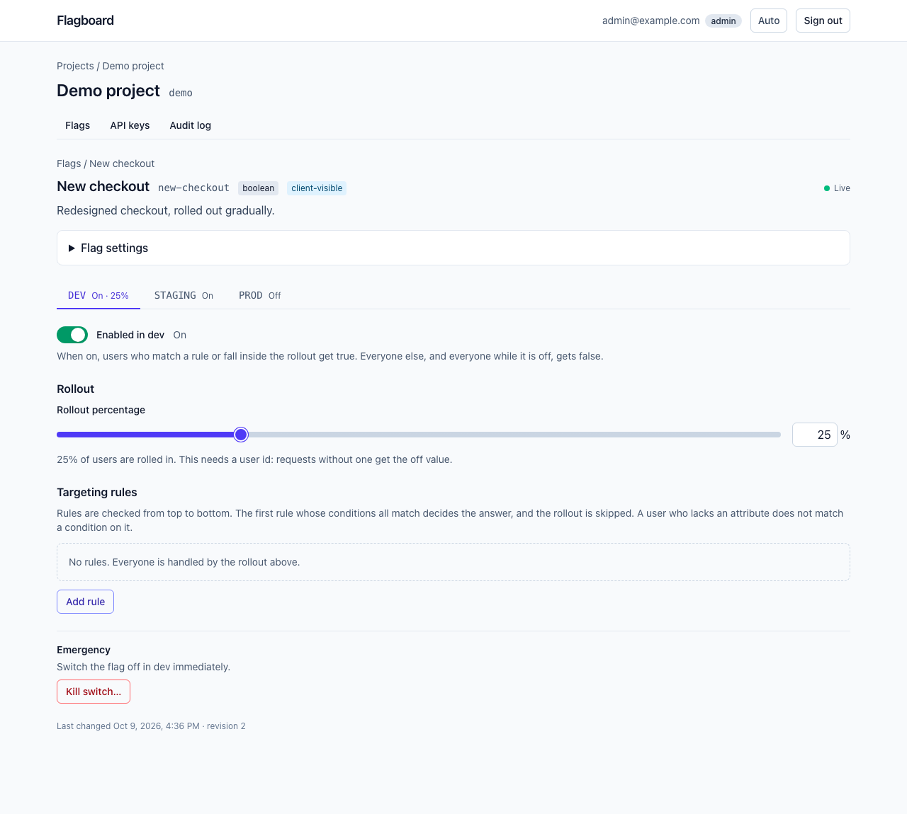
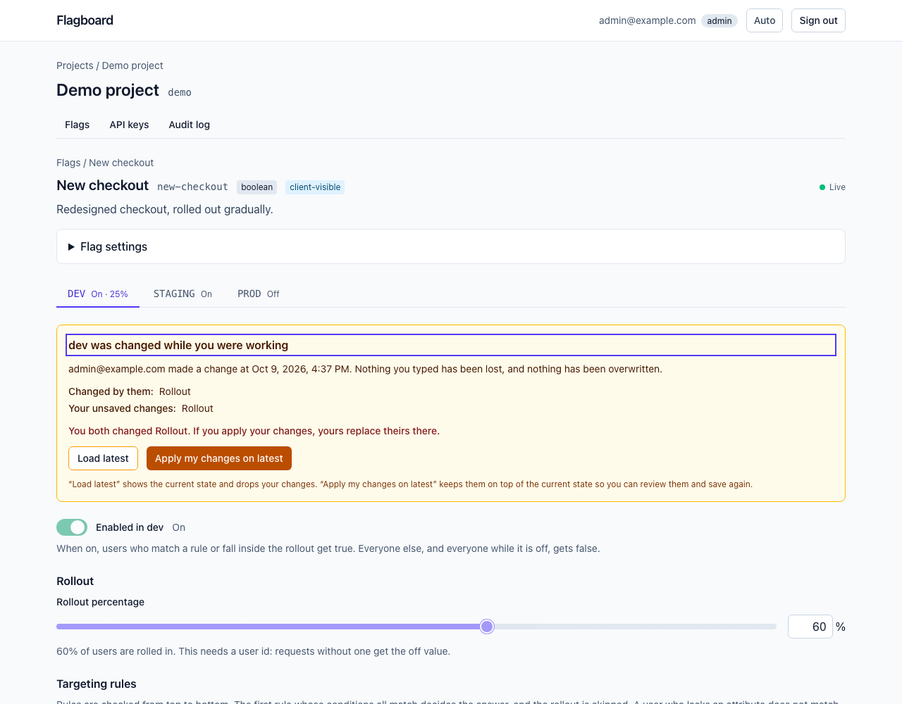
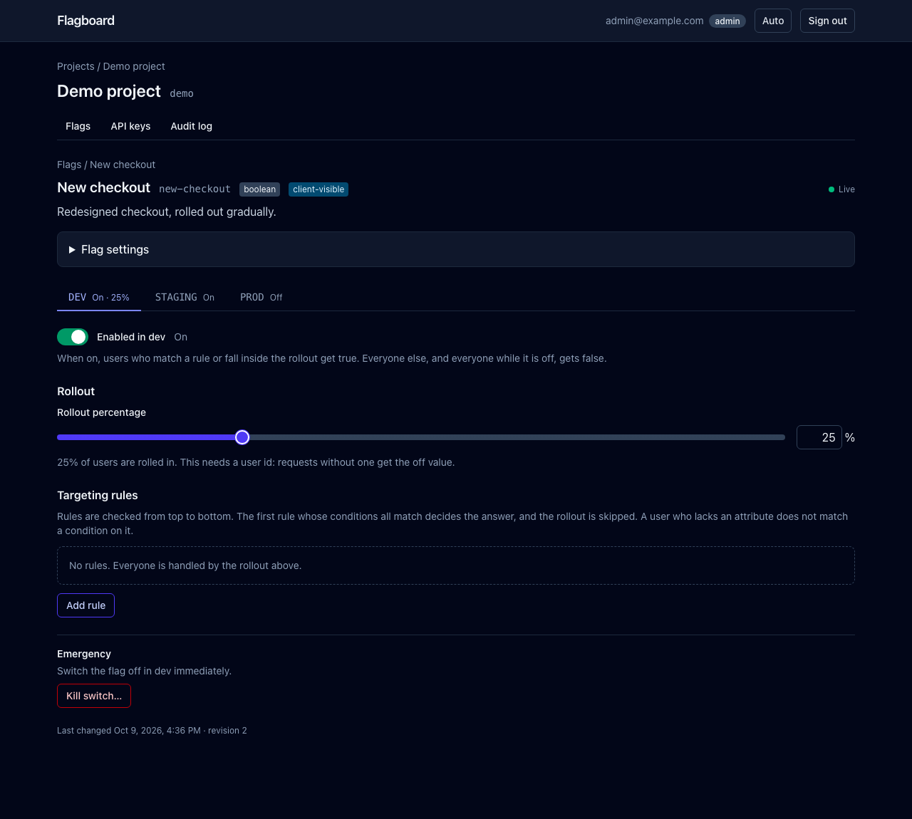
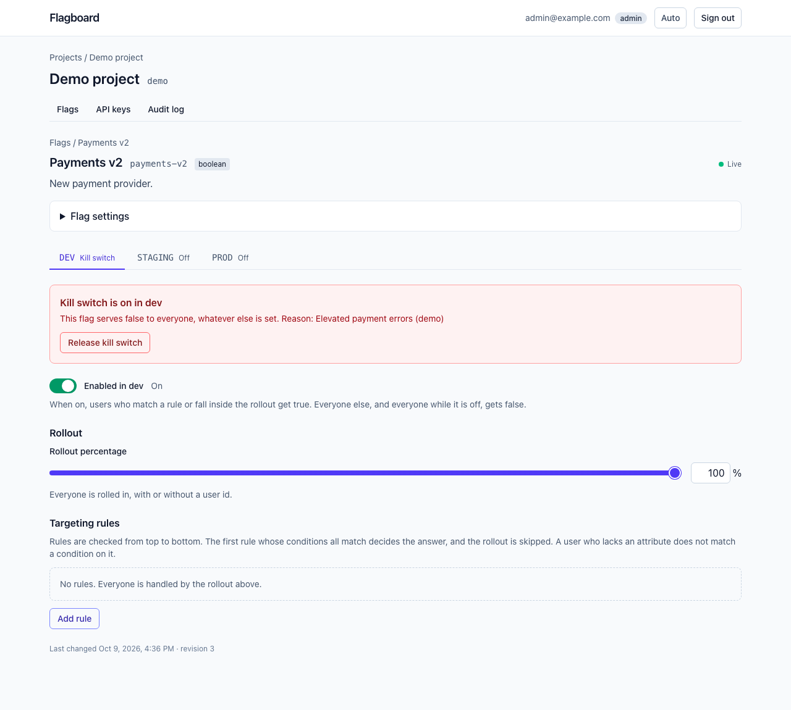
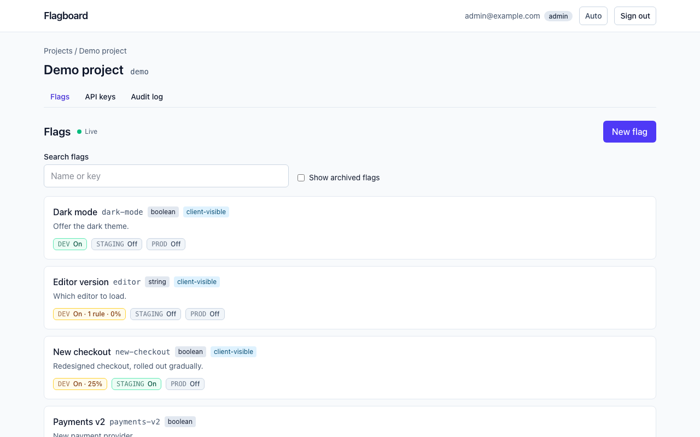
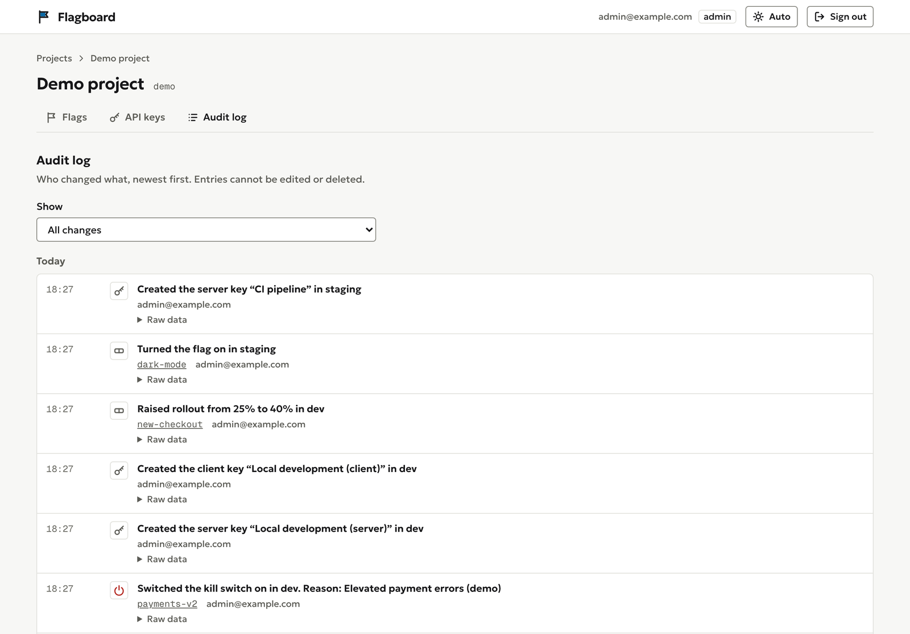
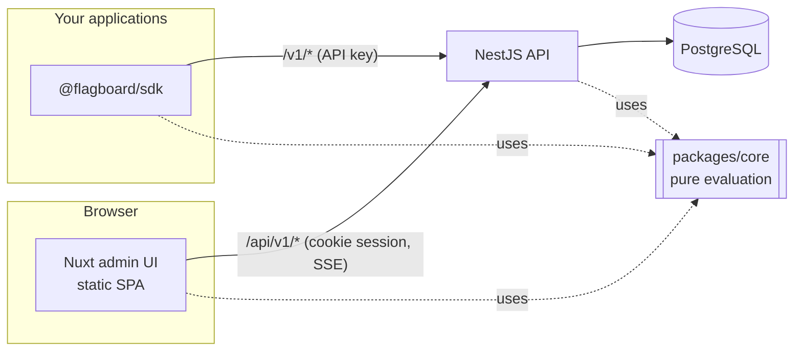

# Flagboard

A small feature-flag service: an admin UI to define flags, per-environment rules and percentage rollouts, and an API
and SDK that applications call to ask "is this flag on for this user?".

It is a portfolio project. It is built to be read and explained, not to be deployed as it is; see
[Known limitations](#known-limitations).

## Screenshots

Taken from the seeded demo data (`pnpm db:seed`), so they show what you get after the quick start.



When two people edit the same environment, nothing is overwritten. The second person keeps their unsaved draft and
chooses to load the latest state or apply their changes on top of it.



| Dark theme                                                           | Kill switch on                                                 |
| -------------------------------------------------------------------- | -------------------------------------------------------------- |
|  |  |





## The problem

Shipping code and turning a feature on are two different decisions. Without flags, every release is a launch. With
flags you can merge unfinished work behind a switch, roll a feature out to 5% of users, target one customer, and
switch it off without a deploy. Flagboard is the smallest honest version of that: flags per project and environment,
targeting rules, deterministic percentage rollout, an audit log of every change, and live updates in the UI.

## How it fits together



| Path            | What it is                                                                                         |
| --------------- | -------------------------------------------------------------------------------------------------- |
| `apps/api`      | NestJS API. TypeORM with migrations, PostgreSQL, JWT access tokens plus rotating refresh tokens.   |
| `apps/web`      | Nuxt 4 admin UI, built as a static single-page app (`ssr: false`), served by nginx in the image.   |
| `packages/core` | Pure TypeScript: rule matching and rollout hashing. No I/O, shared by the API, the SDK and the UI. |
| `packages/sdk`  | Typed client. A remote client calls the API; a local client evaluates a snapshot in your process.  |
| `apps/e2e`      | One Playwright test with an accessibility scan.                                                    |
| `docs/adr`      | Architecture decision records: why each non-obvious choice was made.                               |

## Quick start

Needs Node 24 (`.nvmrc`), pnpm and Docker.

```bash
cp .env.example .env     # placeholders for local use only
pnpm install
pnpm infra:up            # PostgreSQL in Docker
pnpm db:migrate
pnpm db:seed             # demo data; prints two API keys once
pnpm dev                 # web on :3010, API on :4010
```

Sign in at http://localhost:3010 as `admin@example.com` with `SEED_ADMIN_PASSWORD` from `.env`. The
[getting-started guide](docs/guides/getting-started.md) continues with a curl walkthrough: create a flag, mint a key,
evaluate it, change the rollout, evaluate again.

## Routes

| Namespace   | Who calls it                 | Auth                              | CORS                        |
| ----------- | ---------------------------- | --------------------------------- | --------------------------- |
| `/v1/*`     | Your applications, the SDK   | API key (`Authorization: Bearer`) | Only on `POST /v1/evaluate` |
| `/api/v1/*` | The admin UI                 | Access token, role checked        | None (same origin)          |
| `/health`   | Orchestrators, health checks | None                              | None                        |

- `POST /v1/evaluate` answers CORS requests from any origin without credentials, so a **client key** can be used from
  a browser on another origin. `GET /v1/snapshot` and the whole admin API send no CORS headers.
- The admin UI is same-origin with the API: Nuxt's dev proxy in development, nginx in the web image.
- Public routes are rate limited per API key (plus failed key attempts per address); sign-in (strictly) and token refresh and sign-out (loosely) are rate limited per address.

## Keys, and what a client key may know

A **server key** can fetch the full snapshot (rules, salts, rollout) and evaluate. A **client key** can only
evaluate, never receives rules or attribute values, and sees a flag only when `client_visible` is true (default
false). A flag that is not visible to a client key behaves exactly like an unknown flag. Keys are random, shown once
and stored only as a SHA-256 hash. See [ADR 0008](docs/adr/0008-two-key-kinds.md).

**Targeting by client-supplied attributes is advisory (spoofable).** A client chooses the attributes it sends, so
any rule that depends on them can be bypassed by a user who edits their own requests. Security-sensitive decisions
belong to server keys, where the application supplies trusted attributes.

## Using the SDK

```ts
import { createRemoteClient } from '@flagboard/sdk';

const flags = createRemoteClient({
  baseUrl: 'http://localhost:4010',
  key: process.env.FLAGBOARD_KEY!,
});
const result = await flags.evaluate(
  'new-checkout',
  { userId: 'user-42', attributes: { plan: 'pro' } },
  false,
);
```

The [SDK guide](docs/guides/sdk.md) has the exact API, the local (snapshot) client, timeouts and error handling.

## Security notes

- Input is validated with DTOs at every edge, with bounded sizes on public endpoints.
- The application's database role has no DDL rights and no `UPDATE`, `DELETE` or `TRUNCATE` on `audit_events`; the
  migrator role changes the schema. The e2e tests run with both roles to prove it.
- Short-lived access tokens; refresh tokens live in an `httpOnly` cookie, rotate on use, and reuse revokes the family.
  Passwords are hashed with bcrypt. Logs redact secrets.
- CI is written with pinned action SHAs, a read-only token, no `pull_request_target` and a secret scan. See
  [SECURITY.md](SECURITY.md) to report an issue.

## Testing

```bash
pnpm lint && pnpm typecheck && pnpm test      # unit and component
pnpm test:e2e                                  # API against real PostgreSQL (pnpm infra:up first)
pnpm build && pnpm test:browser                # Playwright with an axe scan
```

Layers and what each one proves are in the [testing guide](docs/guides/testing.md).

## Benchmark

One run on a laptop, not a guarantee. Machine: Apple M4 Pro, 12 cores, 24 GB, macOS (Darwin arm64), Node 24.21.0,
PostgreSQL in Docker on the same machine, API and load generator on the same machine. `pnpm bench` (autocannon):
5 s warm-up, then 20 s at 200 requests per second over 10 connections, one endpoint at a time.

| Endpoint                        | Requests | p50  | p90  | p97.5 | p99  | Target (p95) |
| ------------------------------- | -------- | ---- | ---- | ----- | ---- | ------------ |
| `POST /v1/evaluate`             | 4000     | 0 ms | 1 ms | 2 ms  | 2 ms | < 25 ms, met |
| `GET /v1/snapshot` (`304` path) | 4001     | 0 ms | 1 ms | 1 ms  | 1 ms | < 10 ms, met |

autocannon does not report p95, so the script checks the targets against p97.5, which is never lower than p95. The
rate limit is raised for the run. The test uses a fixed, small load: it says nothing about throughput limits, other
hardware, a network between client and server, or a larger dataset.

## Decisions

Each non-obvious choice has a one-page record in [`docs/adr`](docs/adr): the pure core, rollout hashing, refresh
rotation, the audit log, optimistic locking, key storage, key kinds, the snapshot ETag, SSE over WebSocket, the
single-instance design, and the SPA with a same-origin proxy and CSP.

## Known limitations

- **Single instance.** Rate-limit counters, the snapshot cache and the SSE stream registry live in the API
  process's memory ([ADR 0011](docs/adr/0011-single-instance.md)). Running two API instances would split them.
- **Audit log is tamper-evident only against the application.** The app role cannot change or delete audit rows,
  but whoever owns the database (the migrator role, a superuser) can. There is no pruning of old events.
- **Advisory client attributes.** Targeting by attributes a client sends can be bypassed (see above).
- **CSP covers the web image only.** The policy (script hashes, `frame-ancestors 'none'` and so on) is produced by the
  web image's nginx configuration. `pnpm dev` and `nuxt dev` do not send it. `style-src` allows `'unsafe-inline'`.
- **Browsers tested:** Chromium only. Firefox and Safari were not tested, including the CSP hashes.
- **GitHub CI has never run.** The workflows pass `actionlint` and were checked by hand and with local equivalents
  of their commands, but no run on GitHub has been seen.
- **No deployment target.** There are Dockerfiles for both apps and a Compose file for PostgreSQL only; there is no
  Compose stack for the whole system, no Terraform and no hosting. The web image's nginx resolves the API host name
  once at start, so the API must be up first.
- **No user-management UI.** Users exist in the API (admin endpoints), but the UI cannot create, change or remove
  them; the seed script creates the demo accounts.
- **Live updates:** each user may hold five event streams by default (`SSE_MAX_STREAMS_PER_USER`). A sixth tab closes the oldest one, which then shows
  "Live updates paused: too many tabs" and does not reconnect, to avoid tabs evicting each other in a loop.
- **Browser test runs against `nuxt dev`**, not the built site; the nginx image is checked by hand
  ([testing guide](docs/guides/testing.md)). Images are not vulnerability-scanned.
- **Accessibility** was checked with an automated scan on one page in light mode, not with a screen reader or on a
  phone.

## Licence

MIT, see [LICENSE](LICENSE).
